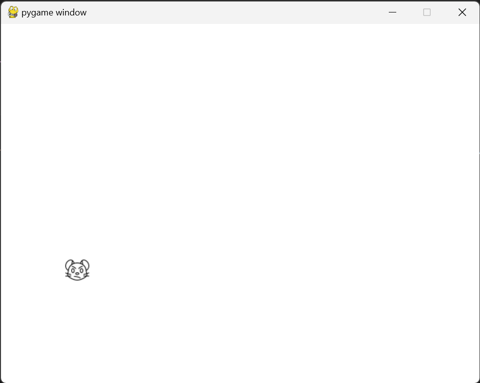

## Pygame Mouse Click Demo

A simple Pygame demo where a angry mouse image moves to a random location within the window when clicked. This project demonstrates basic event handling and image positioning in Pygame.

### Features
- Randomly positions the image on the screen when clicked.
- Handles window close events.
- Ensures the image stays within the window boundaries.

### Requirements
- Python 3.x
- Pygame-ce

### How to Run
1. Clone the repository.
2. Install Pygame: `pip install pygame-ce`
3. Run the script: `python main.py`

### Screenshot

